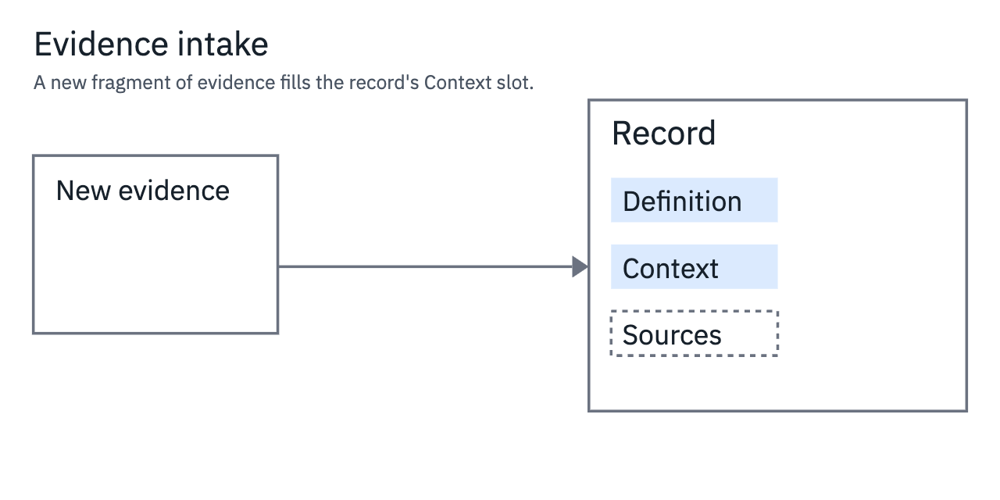

# diagram-authoring

An experimental agent skill and command-line toolkit for explanatory diagrams. Author one standalone SVG; the exporter deterministically produces a portable SVG, an offline HTML preview, a PNG still and an H.264 MP4.



The animated version: [examples/arrival/scene.mp4](examples/arrival/scene.mp4) (8 s, 1280×640, silent). Inline playback depends on the viewer; download the file if needed.

More examples: [convergence](examples/convergence/scene.png) (two drafts merge into one summary, animated) and [branching](examples/branching/scene.png) (a static diagram with two outcomes).

## What this lets you do

Start with the claim a reader should understand, the objects, the relationships and the change. Author the complete settled state in plain SVG, then add declarative SMIL animation. An agent or a person with a text editor can revise the source; the exporter produces stills and video for review.

The toolkit supports agent-assisted authoring and deterministic exports. A passing render does not prove that a diagram explains its subject; see [Limitations](#limitations).

Good use cases: information flows, document lifecycles, decisions and branching, convergence, accumulation into persistent records, and comparisons. When the relationship is static or already familiar to the reader, a still is enough — export `svg,png` and skip the video. Animation earns its keep when order or causality is the point.

## Quickstart

From a clean clone (needs Node 22 or newer):

```sh
git clone https://github.com/igor/diagram-authoring.git
cd diagram-authoring
npm ci
npx playwright install chromium   # on Linux, use --with-deps chromium
mkdir -p out
npm run export -- assets/arrival.svg --out out/arrival --duration 8 --width 1280 --formats svg,png
```

This creates `out/arrival/preview.html`, a portable animated SVG, a frozen SVG, a PNG, font license notices and a verification manifest. Open `preview.html` in a browser to play or scrub the animation offline.

For MP4, install FFmpeg using [Platform setup](#platform-setup), then run:

```sh
npm test
npm run export -- assets/arrival.svg --out out/arrival-video --duration 8 --width 1280 --fps 30
```

The second export includes `scene.mp4`. The test suite also needs FFmpeg because it exercises video output.

The authoring guidance (`SKILL.md` and `references/`) needs no installation at all: read it and draw. Exports need Node ≥ 22, `npm install`, a Chromium browser, and `ffmpeg`/`ffprobe` on PATH for MP4.

## Using it with an agent

The repository root is the installable skill folder. `SKILL.md` is provider-neutral; the instructions below are only about where to put the folder.

### Codex (personal)

```sh
git clone https://github.com/igor/diagram-authoring.git ~/.agents/skills/diagram-authoring
cd ~/.agents/skills/diagram-authoring
npm ci
npx playwright install chromium
```

Invoke it in a conversation with `$diagram-authoring`. Codex discovers personal skills in `~/.agents/skills` and follows symlinked skill directories. [Codex skills documentation](https://learn.chatgpt.com/docs/build-skills), checked 2026-09-09.

For instructions-only use, the clone is sufficient. Export setup requires Node 22+, Linux browser system dependencies where applicable, and FFmpeg for video; see [Platform setup](#platform-setup).

Git refuses to clone into a non-empty destination, protecting an existing skill. To update an installed copy, run `git pull --ff-only` inside it and re-run `npm ci`. If Git reports local changes or divergence, inspect them before updating.

### Codex (project)

Put the skill folder at `.agents/skills/diagram-authoring` inside your project — see [Project scope](#project-scope-both-harnesses) below for how to vendor it correctly. Same invocation: `$diagram-authoring`.

### Claude Code (personal)

```sh
git clone https://github.com/igor/diagram-authoring.git ~/.claude/skills/diagram-authoring
cd ~/.claude/skills/diagram-authoring
npm ci
npx playwright install chromium
```

Invoke it with `/diagram-authoring`. Personal skills live in `~/.claude/skills` and project skills in `.claude/skills`; symlinked directories are supported. [Claude Code skills documentation](https://code.claude.com/docs/en/skills), checked 2026-09-09. Update the same way: `git pull --ff-only`, then `npm ci`. For instructions-only use, the clone is sufficient; export prerequisites are the same as above.

### Project scope (both harnesses)

For a project, vendor the folder rather than cloning into it. A `git clone` inside your project creates a nested Git repository that the project's own commits will not capture. Instead:

```sh
diagram_install_tmp="$(mktemp -d)"
git clone https://github.com/igor/diagram-authoring.git "$diagram_install_tmp/source"
# Run from the project root. For Claude Code, change .agents to .claude.
diagram_skill_target=.agents/skills/diagram-authoring
if [ -e "$diagram_skill_target" ] || [ -L "$diagram_skill_target" ]; then
  echo "Destination already exists; inspect it before updating."
else
  mkdir -p "$diagram_skill_target"
  rsync -a --exclude .git --exclude node_modules --exclude out "$diagram_install_tmp/source/" "$diagram_skill_target/"
fi
```

After a successful copy, run `npm ci` and the browser setup inside the skill folder if you need exports. Commit the vendored files, excluding `node_modules/` and generated work. The temporary clone is left for inspection. Both harnesses also support symlinks to a shared clone, but teammates need a clone at the symlink target too.

### Other agents

No plugin wrapper is needed for this release. Point the agent at `SKILL.md` together with `references/`, `scripts/` and `assets/`, let it read the guidance, and run the CLI from that folder. Skill-directory conventions for other harnesses are not verified here; do not invent them.

### Detection and scope notes

- Codex picks up changed skill files automatically; restart the session if a change is not detected.
- Claude Code may need a fresh session before a newly installed skill's slash command appears; discovery depends on the install scope and the harness's policies.
- A personal install on one machine does not carry over to remote or cloud harness sessions.
- The skill works from any installed location: tool paths resolve relative to the skill folder, and outputs go to a new directory you choose — existing files are never overwritten.

## Command-line operation (no harness)

The exporter is a plain Node CLI and needs no agent at all:

```sh
node scripts/export.mjs INPUT.svg --out NEW_DIRECTORY [options]
```

| Option | Meaning |
| --- | --- |
| `--out DIR` | output directory (required); must not already exist, and its parent must exist |
| `--duration S` | animated timeline length in seconds (default 8, max 120) |
| `--width PX` | output width in pixels, even, max 4096 (default 1280) |
| `--fps N` | video frames per second, 1–60 (default 30) |
| `--time S` | still capture time within `[0, duration]` (default: duration) |
| `--formats LIST` | comma-separated subset of `svg,png,mp4` (default all three) |
| `--fonts PATH` | font manifest JSON (see [Fonts](#fonts)) |
| `--browser PATH` | absolute path to a Chrome/Chromium executable |
| `--playwright P` | absolute path to the playwright module (dir or index.js) |

Every export writes `scene.svg`, `preview.html`, `manifest.json` and the selected fonts' license texts. Requested formats add `scene.static.svg`, `scene.png` and `scene.mp4`. See [references/export.md](references/export.md) for supported SMIL, validation rules and verification guidance.

## Fonts

Bundled by default: IBM Plex Sans 400 and IBM Plex Mono 400, Latin WOFF2 subsets under the SIL Open Font License 1.1 (notices in `assets/fonts/`). Exports embed these faces unless you select a custom font set; the selected fonts' license texts accompany the bundle.

To select a different set, write a manifest and pass `--fonts`:

```json
[
  { "family": "IBM Plex Sans", "weight": "400", "file": "fonts/plex-sans.woff2", "license": "fonts/plex-sans-OFL.txt" }
]
```

```sh
mkdir -p out
node scripts/export.mjs scene.svg --out out/scene --fonts /path/to/fonts.json
```

`file` and `license` resolve relative to the manifest's directory. Fonts must be valid, non-empty WOFF2 files with non-empty license texts. Family and weight are validated against strict character rules (they are interpolated into CSS), duplicate family/weight pairs are rejected, and colliding license filenames get deterministic prefixed names. Fonts are never fetched from the network. Changing the manifest does not rewrite `font-family` names already present in your SVG sources and does not guarantee glyph coverage for them.

## Platform setup

- **macOS**: Node ≥ 22 (Homebrew or nvm); `brew install ffmpeg` for MP4 output. An existing Google Chrome is used as a browser fallback; otherwise `npx playwright install chromium`.
- **Ubuntu/Debian**: `sudo apt-get install ffmpeg`; `npx playwright install --with-deps chromium` installs the managed browser plus its system dependencies.
- **Windows / WSL**: not tested, and not claimed to work.
- No API key is needed for any export. Running an agent that authors diagrams requires that harness's own subscription or access, independent of this toolkit.

## Modifying an example

Copy `assets/branching.svg` to `scene.svg`, open it in a text editor, and change the record labels and corridor conditions. The example provides a background covering the viewBox, an 8-unit placement grid and two records with distinct ports. Keep the first rect covering the whole viewBox and stay within the bundled fonts, then:

```sh
mkdir -p out
npm run export -- scene.svg --out out/scene --width 1280 --formats svg,png
```

For animation, study `assets/arrival.svg`: the base markup is the complete final state; SMIL moves a chip along a reserved corridor and fills a slot; every animation shares one duration and a common start.

## Sample prompts

- Use $diagram-authoring to explain how a support ticket becomes a knowledge-base article, and export a 1280px still plus an 8-second MP4.
- Use $diagram-authoring to draw a static comparison of two purchase-approval paths; export SVG and PNG only.

(With Claude Code, invoke the skill as `/diagram-authoring`; with other agents, point them at `SKILL.md` and run the CLI yourself.)

## Limitations

- No GIF output; video is MP4 only. No HTML importer: author a standalone SVG first.
- No automatic portrait layout for phones; compose a separate portrait SVG when the landscape layout would make text too small.
- The bundled fonts are Latin subsets; other scripts need their own verified font assets and licenses.
- The exporter validates authored input and blocks network access during rendering, but it is not a sandbox for hostile SVG. Do not feed it untrusted diagrams.
- No guarantee of comprehension: a render that passes every check can still fail to explain its subject.
- Safari, physical touch and screen-reader behavior are not validated; state what remains untested when you deliver a diagram.
- Windows/WSL is untested.

## License and status

Code, documentation and examples are MIT-licensed (see [LICENSE](LICENSE)). The bundled IBM Plex fonts use SIL Open Font License 1.1; preserve their notices when redistributing. Custom fonts retain their own licenses. Supply the appropriate notice and confirm permission to embed and distribute each font; the exporter checks the files, not licensing rights.

This is an experimental release: the file layout, CLI and behavior may change. Contributions are welcome — open an issue or pull request, keep the export contract described in `references/export.md`, and run `npm test` plus the quickstart before proposing changes.
